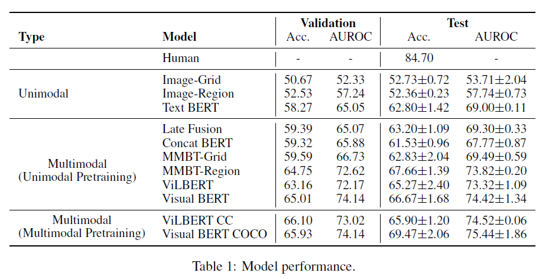
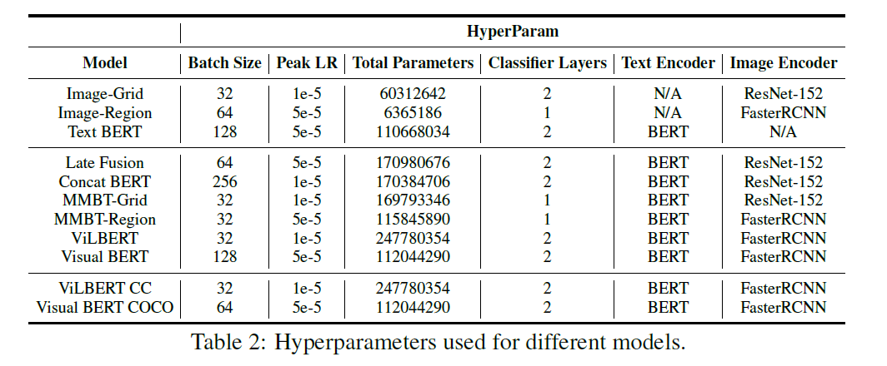

# Hateful Memes Detection

### Competition Resources:

- [Competition page](https://hatefulmemeschallenge.com/)
- Data Preprocessing [link](https://github.com/HimariO/HatefulMemesChallenge/tree/main/data_utils)
- Data Preparation [link](https://github.com/facebookresearch/mmf/blob/master/projects/hateful_memes/README.md#prerequisites)
- Dataset [paper](https://arxiv.org/abs/2005.04790)


### Prerequisite: 
- install [MMF](https://mmf.sh/docs)
- Download zip file under competition page location x.
- The password will be y (it can be arbitrary with --bypass_checksum=1 command)
- In mmf/mmf_cli/hm_convert.py need to change the following code before running the previous command:
```python
exists = exists or PathManager.exists(os.path.join(folder, "data", file)) to exists = exists or PathManager.exists(os.path.join(folder, "hateful_memes", file))
```
- Run the following command to unzip and format your files into MMF format
```
mmf_convert_hm --zip_file=x --password=y --bypass_checksum=1
```
This can take A WHILE

The zip file will be converted into correct format and lives in .cache/torch/mmf/data/datasets/hateful_memes/defaults

To replace the annotation with needed one, add flags 

```commandline
  dataset_config.hateful_memes.annotations.train[0]="hateful_memes/defaults/annotations/train.jsonl" \
  dataset_config.hateful_memes.annotations.val[0]="hateful_memes/defaults/annotations/dev_unseen.jsonl" \
  dataset_config.hateful_memes.annotations.test[0]="hateful_memes/defaults/annotations/test_unseen.jsonl"
```

### Reproducing Baselines:

Use MMF to train an existing baselines. You can adjust the batch size, maximum number of updates, log and evaluation interval as well as other things. Read more about [MMF's configuration system](https://mmf.sh/docs/notes/configuration/).


#### Train the model
```commandline
mmf_run config=projects/hateful_memes/configs/mmbt/defaults.yaml \
  model=mmbt \
  dataset=hateful_memes \
  training.log_interval=50 \
  training.max_updates=3000 \
  training.batch_size=16 \
  training.evaluation_interval=500
```
- Baseline Models Results in the paper:

Note: The detailed Baseline Model Result reproduced by me is in Baseline.md file.

- Hyperparameters in the original paper:



## Ensemble Learning

I applied ensemble learning with Majority Vote and Mean Probability. The code is in ensemble.py file. Run the following to get the ensemble learning result.

```commandline
python ensemble.py
```

## Generate Image Captioning for the Memes

### Show and Tell : A Neural Image Caption Generator
Pretrained model for Tensorflow implementation found at tensorflow/models of the image-to-text paper described at:

"Show and Tell: Lessons learned from the 2015 MSCOCO Image Captioning Challenge." - Oriol Vinyals, Alexander Toshev, Samy Bengio, Dumitru Erhan.

Link to the Pretrain model [inceptionv3 finetuned parameters over 1M](https://drive.google.com/file/d/1r4-9FEIbOUyBSvA-fFVFgvhFpgee6sF5/view)

Full text of the original [paper](http://arxiv.org/abs/1609.06647) 

### Generate captions for all images in the dataset

Check this [repo](https://github.com/evahuyn/ImageCaptioning)

### Combine Image Caption with the text input

The image caption and text caption is concatenate as the textual inputs. 

