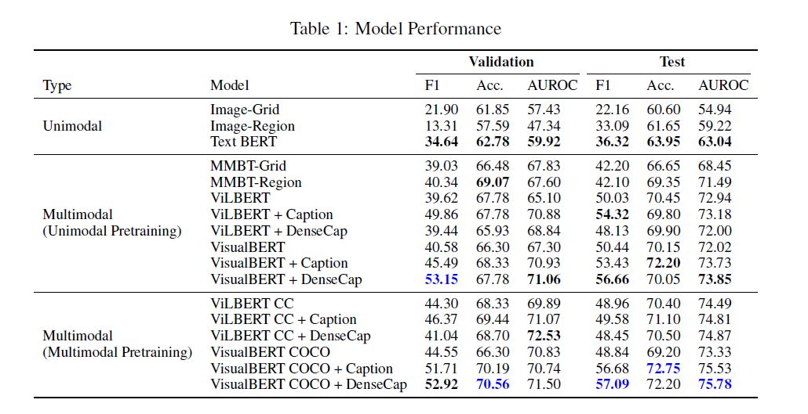

# Hateful Memes Detection

### Competition Resources:

- [Competition page](https://hatefulmemeschallenge.com/)
- Data Preprocessing [link](https://github.com/HimariO/HatefulMemesChallenge/tree/main/data_utils)
- Data Preparation [link](https://github.com/facebookresearch/mmf/blob/master/projects/hateful_memes/README.md#prerequisites)
- Dataset [paper](https://arxiv.org/abs/2005.04790)


### Prerequisite: 
- install [MMF](https://mmf.sh/docs)
- Download zip file under competition page location x.
- The password will be y (it can be arbitrary with --bypass_checksum=1 command)
- In mmf/mmf_cli/hm_convert.py need to change the following code before running the previous command:
```python
exists = exists or PathManager.exists(os.path.join(folder, "data", file)) to exists = exists or PathManager.exists(os.path.join(folder, "hateful_memes", file))
```
- Run the following command to unzip and format your files into MMF format
```
mmf_convert_hm --zip_file=x --password=y --bypass_checksum=1
```
This may take sometime.

The zip file will be converted into correct format and lives in .cache/torch/mmf/data/datasets/hateful_memes/defaults

### Reproducing Baselines:

Use MMF to train an existing baselines. You can adjust the batch size, maximum number of updates, log and evaluation interval as well as other things. Read more about [MMF's configuration system](https://mmf.sh/docs/notes/configuration/).

Note: until this part was the code for midterm.

## Generate Image Captioning for the Memes

### Show and Tell : A Neural Image Caption Generator
Pretrained model for Tensorflow implementation found at tensorflow/models of the image-to-text paper described at:

"Show and Tell: Lessons learned from the 2015 MSCOCO Image Captioning Challenge." - Oriol Vinyals, Alexander Toshev, Samy Bengio, Dumitru Erhan.

Link to the Pretrain model [inceptionv3 finetuned parameters over 1M](https://drive.google.com/file/d/1r4-9FEIbOUyBSvA-fFVFgvhFpgee6sF5/view)

Full text of the original [paper](http://arxiv.org/abs/1609.06647) 

### Generate captions for all images in the dataset

Check this [repo](https://github.com/evahuyn/ImageCaptioning)

Please use the ImageCaptioning zip.

### Combine Image Caption with the text input

The image caption and text caption is concatenate as the textual inputs. 

## Generate Dense Image Captions

I applied the [DenseCap](https://cs.stanford.edu/people/karpathy/densecap/) model to generate dense image captions for the memes. 

Please run this pytorch implementation of DenseCap in this [repo](https://github.com/evahuyn/densecap-pytorch). 

Please use the densecap-pytorch zip. 

## Train the model

The modified models are under mmf/mmf/experiments folder. 

```commandline
cd mmf
```
Generated captions are stored in Im2txt/im2txt/data/hateful_memes/annotations

Replace the annotation with needed one, add flags 

```commandline
dataset_config.hateful_memes.annotations.train[0]="hateful_memes/defaults/annotations/caption_added/caption_train.jsonl" \
dataset_config.hateful_memes.annotations.val[0]="hateful_memes/defaults/annotations/caption_added/caption_dev_unseen.jsonl" \
dataset_config.hateful_memes.annotations.test[0]="hateful_memes/defaults/annotations/caption_added/caption_test_unseen.jsonl"
```

In mmf/mmf/experiments you'll see vilbert_v1 and visual_bert_v1. The command is stored in note.txt and dense_caption_added.txt. Copy the command in the files to command line to run the model. The training results store in result.txt in each sub folder.
```
# example run command
mmf_run config=experiments/vilbert_v1/experiment_defaults.yaml model=vilbert_v1 /
dataset=hateful_memes run_type=train_val /
dataset_config.hateful_memes.annotations.train[0]="hateful_memes/defaults/annotations/caption_added/caption_train.jsonl" /
dataset_config.hateful_memes.annotations.val[0]="hateful_memes/defaults/annotations/caption_added/caption_dev_unseen.jsonl" /
dataset_config.hateful_memes.annotations.test[0]="hateful_memes/defaults/annotations/caption_added/caption_test_unseen.jsonl" /
env.save_dir="./save/vilbert_v1"
```
- Model Results:



## Ensemble Learning

I applied ensemble learning with Majority Vote and Mean Probability. The code is in ensemble.py file. Run the following to get the ensemble learning result.

```commandline
python ensemble.py
```


