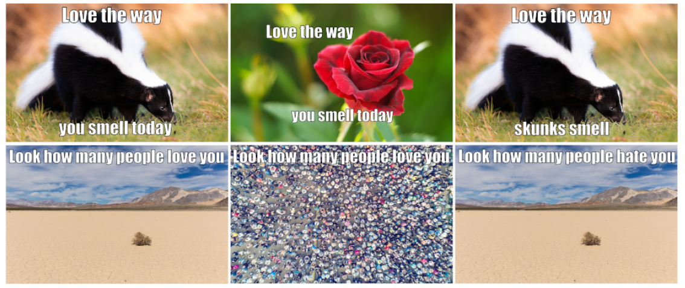
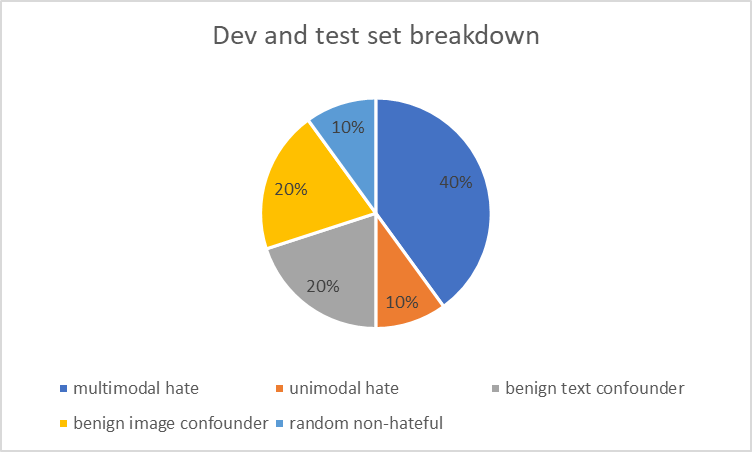

# Hateful Memes Dataset

- Dataset [paper](https://arxiv.org/abs/2005.04790)

### Dataset Description

- A dataset totalling exactly 10k memes
  - dev set: 5%
  - test set 10%
  
  
- The dataset comprises five different types
of memes: 
  - multimodal hate: benign confounders were found for both modalities
  - unimodal hate: one or both modalities were already hateful on their own
  - benign image confounders
  - benign text confounders 
  - random not-hateful examples.